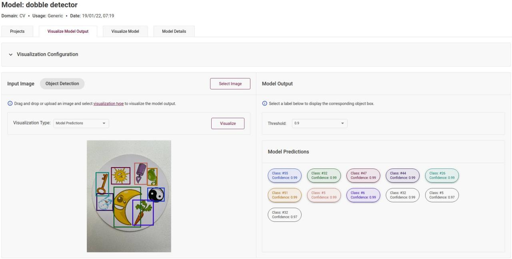

# Spot It Detector

The project to automate recognition images shown on two cards in [Spot It](https://www.spotitgame.com/) game. 
The main idea is to train an object detection neural network to recognize set of images on two cards separatly and match common classes in these cards.

# Detector
As a basic detector was chosen [YoloV4 neural network](https://arxiv.org/abs/2004.10934) and used transfer learning for a [specific dataset](https://www.kaggle.com/atugaryov/dobble-object-detection) using the [darknet](https://github.com/AlexeyAB/darknet) repository. 

In [the releases](https://github.com/artyomtugaryov/spot-it-detector/releases) you can find pre-trained Spot It detector in in darknet, TensorFlow 2.x and [OpenVINO IR](https://github.com/openvinotoolkit/openvino) formats.
The latest result of the detector:

