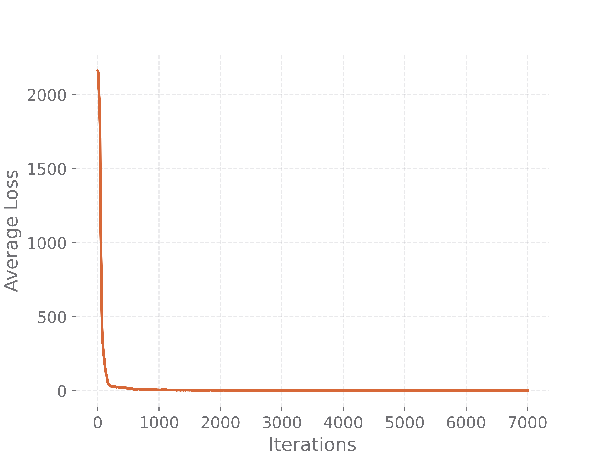
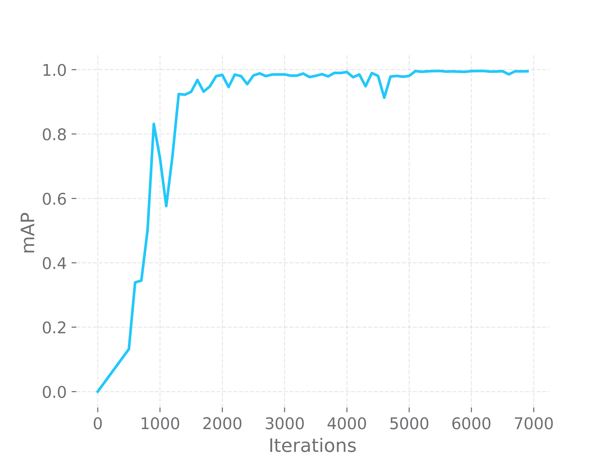

# How to train YoloV4 Dobblenet in the Darknet format

Once upon a time, when everyone was working from the office and didn’t even 
think about working remotely, my colleagues and I decided to take a break and 
play a game to unwind a bit. We picked a game called Dobble a.k.a. Spot it. 

## The Dobble

Dobble is a game for all ages that tests your reaction and powers of observation. 
Its cards have a circular shape, each card contains 8 images of certain cartoon 
icons, such as `Taxi`, `Apple`, `Target` etc. Overall, there are 57 kinds of 
icons and 55 cards in the game.

Every two cards may only have one icon in common, and it is the player's 
goal to find a card that has a matching image and to put it on the desk before 
anyone else does. Then, all the players begin to look for the common image 
between their cards and the card that was put on the desk, and so it goes. 
The player who gets rid of all their cards the fastest wins. 

You can find more details on the game on the [website](www.dobblegame.com).
Here is what Dobble cards look like:


After we played it several times, it occurred to us how cool it would be to 
create a program that could play Dobble with you, or even against you. 
Especially since this game requires high reaction speed, a computer would 
probably easily outplay the speediest human player out there. So, this is how 
the idea to create an application for playing Dobble was born.

Given the fact that we are a big OpenVINO team that works on creating a 
framework for neural networks inference and optimisation, it is only natural 
that we decided to use our DL Workbench to build all the necessary tools. 

## Task to be solved

You cannot train a model without firstly determining what task it should solve. 
We had many thoughts on this matter, and finally decided to stick with Object 
Detection. In other words, a model must be able to not only find an image on the 
card, but to also determine its exact position. At the moment, the most popular 
OD model appeared to be YoloV4, so we chose this topology. You can see more 
information about YoloV4 [here](https://arxiv.org/abs/2004.10934).  

## Data

Having a sufficient amount of data is crucial for successful model training, 
so we collected a dataset by photographing every Dobble card we had. Given the 
fact that Dobble deck consists of 55 cards, and we took around 4 photos of each 
from different angles, we obtained almost 390 photos. Quite a lot of work!

However, there was more to come. The main challenge of creating a good usable 
dataset is its annotation. Having 8 images in each photo, we had to determine 
coordinates of 3120 icons in total. Fortunately, there are helpful tools for 
such cases. We used [CVAT tool](https://github.com/openvinotoolkit/cvat) that 
provides convenient interface for annotating: for every picture we had to draw 
a rectangle around each object as it is shown in the picture:

 

It took us a week or two to complete this tedious process. You can access the 
fruits of our labor on [Kaggle](https://www.kaggle.com/atugaryov/dobble).

And yet, 390 images is not always enough to train a model. To expand our dataset, 
we turned to the roboflow tool to augment our image collection. As a result, 
we obtained around 900 images. Afterwards, the dataset was split into three 
subsets: train, validation and test, as it is usually done for efficient model 
training. The resulting dataset can be found in the releases section of this 
repository. 

## GPU environment

Finally, having enough data, we started researching information on YoloV4 
transfer learning. It is known that one of the most important aspects of model 
training is to obtain access to hardware with a GPU. We got lucky here: our 
company provided us with an Nvidia GPU, so we only had to worry about setting up 
the rest, i.e. drivers and CUDA environment. You can find extensive instruction 
for that in the Nvidia materials. 

## Set up Darknet repository

The next step is environment preparation for YoloV4 transfer learning. We used 
a fork of Darknet repository by AlexeyAB to process transfer learning. 

To start the process, clone the main repository of the Dobblenet:
    
```sh
git clone git@github.com:artyomtugaryov/dobblenet.git
cd dobblenet
```

The repository contains all the required assets (scripts, data and 
documentation) to recreate Dobblenet. The next step we should to take is to
prepare python environment:

```sh
python3 -m pip install virtualenv
python3 -m virtualenv venv
source venv/bin/activate

python3 -m pip install -r requirements.txt
```

And then we can download the prepared dataset using scripts from the repository::

```sh
python3 scripts/download_dataset.py --dataset-link https://github.com/artyomtugaryov/dobblenet/releases/download/alpha0.2/dobblenet_dataset.zip
```

The dataset will appear in the `dataset` subfolder of the repository root.
As stated before, we are going to use the Darknet repository from the 
[AlexeyAB fork](https://github.com/AlexeyAB/darknet). 
So, we also need to clone it:  

```sh
git clone git@github.com:AlexeyAB/darknet.git
```

Then, move dataset files to the folder with Darknet repository:

```sh
python3 scripts/spread_dataset.py
```

Darknet is a library helps to train, validate and test Dobblenet. 
To start using Darknet we need to build it from the sources. In order to do 
this, we should firstly configure the `Makefile` in the root of the Darknet 
folder. Open the `Makefile` inside the darknet repository and make the 
following changes:  

If you have set up GPU and CUDNN:

    1. `GPU=0` -> `GPU=1` 
    2. `CUDNN=0` -> `CUDNN=1`


In addition, to speed up the training, it is  recommended to change this as well:

    1. `OPENCV=0` -> `OPENCV=1`
    2. `AVX=0` -> `AVX=1`

The next step is initialize the CUDA environment:
    
```sh
export LD_LIBRARY_PATH="/usr/local/cuda-11.0/lib64:$LD_LIBRARY_PATH"
export PATH="/usr/local/cuda-11.0/bin/:$PATH"
```

And now we can finally compile the darknet:
    
```sh
cd darknet
make -j 4
mkdir training
```

After successful build, you can find `darknet` binary file in the root of the 
darknet repository 

As we are going to perform transfer learning, we need to download the weights 
of the pre-trained YoloV4 

```sh
wget https://github.com/AlexeyAB/darknet/releases/download/darknet_yolo_v3_optimal/yolov4.conv.137
```

The Darknet provides the opportunity to train different neural networks. We need 
to create configuration for YoloV4 topology. Its configuration file is already 
in the Dobblenet folder, and you can use it right away to start training:

```sh
./darknet detector train data/obj.data ../configs/dobblenet.darknet.cfg yolov4.conv.137 -dont_show -map | tee training.log
```

Training logs will be saved to `training.log` file.
Here is what the first output should look like:

```
CUDA-version: 11000 (11060), cuDNN: 8.0.4, GPU count: 1  
OpenCV version: 4.2.0
Prepare additional network for mAP calculation...
0 : compute_capability = 750, cudnn_half = 0, GPU: NVIDIA GeForce GTX 1650 with Max-Q Design 
net.optimized_memory = 0 
mini_batch = 1, batch = 64, time_steps = 1, train = 0 
layer   filters  size/strd(dil)      input                output
0 Create CUDA-stream - 0 
Create cudnn-handle 0 
conv     32       3 x 3/ 1    416 x 416 x   3 ->  416 x 416 x  32 0.299 BF
...
608 x 608 
Create 6 permanent cpu-threads 
try to allocate additional workspace_size = 81.03 MB 
CUDA allocate done! 
Loaded: 5.643464 seconds
v3 (iou loss, Normalizer: (iou: 0.07, obj: 1.00, cls: 1.00) Region 139 Avg (IOU: 0.000000), count: 1, class_loss = 4643.162598, iou_loss = 0.000000, total_loss = 4643.162598 
v3 (iou loss, Normalizer: (iou: 0.07, obj: 1.00, cls: 1.00) Region 150 Avg (IOU: 0.342851), count: 6, class_loss = 976.097534, iou_loss = 1.449280, total_loss = 977.546814 
v3 (iou loss, Normalizer: (iou: 0.07, obj: 1.00, cls: 1.00) Region 161 Avg (IOU: 0.368945), count: 13, class_loss = 519.587219, iou_loss = 0.669678, total_loss = 520.256897    
....
(next mAP calculation at 1000 iterations) 
1: 2219.531006, 2219.531006 avg loss, 0.000000 rate, 22.141197 seconds, 64 images, -1.000000 hours left
```

In the output, we should pay special attention to the value of loss (or 
mean loss) - it shows how well the network detects icons. The less loss value is,
the better.   

After finishing training process, you are going to see the following message:

```
 calculation mAP (mean average precision)...
 Detection layer: 139 - type = 28 
 Detection layer: 150 - type = 28 
 Detection layer: 161 - type = 28 
 ...
class_id = 0, name = Anchor, ap = 61.72%   	 (TP = 11, FP = 8) 
class_id = 1, name = Apple, ap = 100.00%   	 (TP = 9, FP = 0) 
class_id = 2, name = Baby bottle, ap = 100.00%   	 (TP = 12, FP = 0) 
...
 for conf_thresh = 0.25, precision = 0.90, recall = 0.99, F1-score = 0.94 
 for conf_thresh = 0.25, TP = 652, FP = 74, FN = 5, average IoU = 67.72 % 
 
 IoU threshold = 50 %, used Area-Under-Curve for each unique Recall 
 mean average precision (mAP@0.50) = 0.951733, or 95.17 % 
...
New best mAP!   
If you want to train from the beginning, then use flag in the end of training command: -clear
```

In the text of the message you can find information about mean average precision. 
As we can see in the message, mAP of the model is 0.960822, or 96.0822%. 
This value is achieved after 1000 iterations.  

Using logs, we can plot changes of loss and mean loss throughout training:



In addition, you can find mAP for each class:

```
class_id = 0, name = Anchor, ap = 61.72%   	 (TP = 11, FP = 8) 
class_id = 1, name = Apple, ap = 100.00%   	 (TP = 9, FP = 0) 
class_id = 2, name = Baby bottle, ap = 100.00%   	 (TP = 12, FP = 0) 
class_id = 3, name = Bomb, ap = 100.00%   	 (TP = 6, FP = 0) 
class_id = 4, name = Cactus, ap = 100.00%   	 (TP = 11, FP = 1) 
class_id = 5, name = Candle, ap = 100.00%   	 (TP = 13, FP = 0) 
class_id = 6, name = Carrot, ap = 98.21%   	 (TP = 7, FP = 2) 
class_id = 7, name = Cheese, ap = 100.00%   	 (TP = 14, FP = 0) 
class_id = 8, name = Chess knight, ap = 99.09%   	 (TP = 10, FP = 3) 
class_id = 9, name = Clock, ap = 100.00%   	 (TP = 12, FP = 0) 
class_id = 10, name = Clown, ap = 98.90%   	 (TP = 13, FP = 1) 
class_id = 11, name = Diasy flower, ap = 71.18%   	 (TP = 12, FP = 6) 
class_id = 12, name = Dinosaur, ap = 81.90%   	 (TP = 7, FP = 6) 
class_id = 13, name = Dog, ap = 68.19%   	 (TP = 10, FP = 7) 
class_id = 14, name = Dolphin, ap = 92.56%   	 (TP = 12, FP = 2) 
class_id = 15, name = Dragon, ap = 94.70%   	 (TP = 11, FP = 2) 
class_id = 16, name = Exclamation point, ap = 100.00%   	 (TP = 10, FP = 0) 
class_id = 17, name = Eye, ap = 100.00%   	 (TP = 9, FP = 0) 
class_id = 18, name = Fire, ap = 97.50%   	 (TP = 8, FP = 5) 
class_id = 19, name = Four leaf clover, ap = 100.00%   	 (TP = 13, FP = 0) 
class_id = 20, name = Ghost, ap = 100.00%   	 (TP = 13, FP = 0) 
class_id = 21, name = Green splats, ap = 100.00%   	 (TP = 12, FP = 0) 
class_id = 22, name = Hammer, ap = 100.00%   	 (TP = 11, FP = 0) 
class_id = 23, name = Heart, ap = 96.57%   	 (TP = 14, FP = 2) 
class_id = 24, name = Ice cube, ap = 100.00%   	 (TP = 13, FP = 0) 
class_id = 25, name = Igloo, ap = 93.01%   	 (TP = 12, FP = 2) 
class_id = 26, name = Key, ap = 95.56%   	 (TP = 9, FP = 2) 
class_id = 27, name = Ladybird -Ladybug-, ap = 100.00%   	 (TP = 12, FP = 1) 
class_id = 28, name = Light bulb, ap = 70.88%   	 (TP = 11, FP = 2) 
class_id = 29, name = Lightning bolt, ap = 98.75%   	 (TP = 15, FP = 1) 
class_id = 30, name = Lock, ap = 100.00%   	 (TP = 13, FP = 0) 
class_id = 31, name = Maple leaf, ap = 100.00%   	 (TP = 9, FP = 0) 
class_id = 32, name = Moon, ap = 100.00%   	 (TP = 11, FP = 0) 
class_id = 33, name = No Entry sign, ap = 100.00%   	 (TP = 12, FP = 0) 
class_id = 34, name = Orange scarecrow man, ap = 84.13%   	 (TP = 14, FP = 4) 
class_id = 35, name = Pencil, ap = 90.91%   	 (TP = 10, FP = 0) 
class_id = 36, name = Purple bird, ap = 100.00%   	 (TP = 13, FP = 0) 
class_id = 37, name = Purple cat, ap = 96.67%   	 (TP = 9, FP = 1) 
class_id = 38, name = Purple dobble hand man, ap = 100.00%   	 (TP = 12, FP = 0) 
class_id = 39, name = Question mark, ap = 86.25%   	 (TP = 10, FP = 3) 
class_id = 40, name = Red lips, ap = 100.00%   	 (TP = 14, FP = 0) 
class_id = 41, name = Scissors, ap = 100.00%   	 (TP = 14, FP = 0) 
class_id = 42, name = Skull and crossbones, ap = 100.00%   	 (TP = 10, FP = 0) 
class_id = 43, name = Snowflake, ap = 100.00%   	 (TP = 11, FP = 0) 
class_id = 44, name = Snowman, ap = 66.67%   	 (TP = 6, FP = 5) 
class_id = 45, name = Spider, ap = 92.86%   	 (TP = 13, FP = 0) 
class_id = 46, name = Spider-s web, ap = 96.43%   	 (TP = 7, FP = 1) 
class_id = 47, name = Sun, ap = 100.00%   	 (TP = 9, FP = 1) 
class_id = 48, name = Sunglasses, ap = 100.00%   	 (TP = 13, FP = 0) 
class_id = 49, name = Target-crosshairs, ap = 100.00%   	 (TP = 13, FP = 0) 
class_id = 50, name = Taxi car, ap = 100.00%   	 (TP = 13, FP = 0) 
class_id = 51, name = Tortoise, ap = 100.00%   	 (TP = 11, FP = 0) 
class_id = 52, name = Treble clef, ap = 98.60%   	 (TP = 14, FP = 3) 
class_id = 53, name = Tree, ap = 93.66%   	 (TP = 19, FP = 3) 
class_id = 54, name = Water drip, ap = 100.00%   	 (TP = 12, FP = 0) 
class_id = 55, name = Yin and Yang, ap = 100.00%   	 (TP = 16, FP = 0) 
class_id = 56, name = Zebra, ap = 100.00%   	 (TP = 12, FP = 0) 
```

After training is completed, the resulting weights can be found in 
`darknet/trainig` folder - `_best.weights` and `_last.weights`.

## Accuracy evaluation

Darknet can also help with measuring quality of our neural network in terms of 
mean average precision:

```sh
./darknet detector map data/obj.data ../configs/dobblenet.darknet.cfg training/dobblenet_final.weights
```

As a result of execution of this command, mAP value is displayed for each class
and for the whole validation set.

```
CUDA-version: 11000 (11060), cuDNN: 8.0.4, GPU count: 1  
 OpenCV version: 4.2.0
 0 : compute_capability = 750, cudnn_half = 0, GPU: NVIDIA GeForce GTX 1650 with Max-Q Design 
net.optimized_memory = 0 
mini_batch = 1, batch = 64, time_steps = 1, train = 0 
   layer   filters  size/strd(dil)      input                output
   0 Create CUDA-stream - 0 
 Create cudnn-handle 0 
conv     32       3 x 3/ 1    416 x 416 x   3 ->  416 x 416 x  32 0.299 BF
   1 conv     64       3 x 3/ 2    416 x 416 x  32 ->  208 x 208 x  64 1.595 BF
....
Done! Loaded 162 layers from weights-file 

 calculation mAP (mean average precision)...
 Detection layer: 139 - type = 28 
 Detection layer: 150 - type = 28 
 Detection layer: 161 - type = 28 
84
 detections_count = 686, unique_truth_count = 657  
class_id = 0, name = Anchor, ap = 100.00%   	 (TP = 11, FP = 0) 
class_id = 1, name = Apple, ap = 100.00%   	 (TP = 9, FP = 0) 
class_id = 2, name = Baby bottle, ap = 100.00%   	 (TP = 12, FP = 0) 
class_id = 3, name = Bomb, ap = 100.00%   	 (TP = 6, FP = 0) 
class_id = 4, name = Cactus, ap = 100.00%   	 (TP = 11, FP = 0) 
class_id = 5, name = Candle, ap = 100.00%   	 (TP = 13, FP = 0) 
class_id = 6, name = Carrot, ap = 100.00%   	 (TP = 7, FP = 0) 
class_id = 7, name = Cheese, ap = 100.00%   	 (TP = 14, FP = 0) 
class_id = 8, name = Chess knight, ap = 100.00%   	 (TP = 10, FP = 0) 
class_id = 9, name = Clock, ap = 100.00%   	 (TP = 12, FP = 0) 
class_id = 10, name = Clown, ap = 100.00%   	 (TP = 13, FP = 0) 
class_id = 11, name = Diasy flower, ap = 100.00%   	 (TP = 12, FP = 0) 
class_id = 12, name = Dinosaur, ap = 100.00%   	 (TP = 7, FP = 0) 
class_id = 13, name = Dog, ap = 100.00%   	 (TP = 10, FP = 0) 
class_id = 14, name = Dolphin, ap = 100.00%   	 (TP = 12, FP = 0) 
class_id = 15, name = Dragon, ap = 100.00%   	 (TP = 11, FP = 0) 
class_id = 16, name = Exclamation point, ap = 100.00%   	 (TP = 10, FP = 0) 
class_id = 17, name = Eye, ap = 100.00%   	 (TP = 9, FP = 0) 
class_id = 18, name = Fire, ap = 100.00%   	 (TP = 8, FP = 0) 
class_id = 19, name = Four leaf clover, ap = 100.00%   	 (TP = 13, FP = 0) 
class_id = 20, name = Ghost, ap = 100.00%   	 (TP = 13, FP = 0) 
class_id = 21, name = Green splats, ap = 100.00%   	 (TP = 12, FP = 0) 
class_id = 22, name = Hammer, ap = 100.00%   	 (TP = 11, FP = 0) 
class_id = 23, name = Heart, ap = 100.00%   	 (TP = 14, FP = 0) 
class_id = 24, name = Ice cube, ap = 100.00%   	 (TP = 13, FP = 0) 
class_id = 25, name = Igloo, ap = 100.00%   	 (TP = 12, FP = 0) 
class_id = 26, name = Key, ap = 100.00%   	 (TP = 9, FP = 0) 
class_id = 27, name = Ladybird -Ladybug-, ap = 98.08%   	 (TP = 12, FP = 1) 
class_id = 28, name = Light bulb, ap = 92.86%   	 (TP = 13, FP = 0) 
class_id = 29, name = Lightning bolt, ap = 100.00%   	 (TP = 15, FP = 0) 
class_id = 30, name = Lock, ap = 100.00%   	 (TP = 13, FP = 0) 
class_id = 31, name = Maple leaf, ap = 100.00%   	 (TP = 9, FP = 0) 
class_id = 32, name = Moon, ap = 100.00%   	 (TP = 11, FP = 0) 
class_id = 33, name = No Entry sign, ap = 100.00%   	 (TP = 12, FP = 1) 
class_id = 34, name = Orange scarecrow man, ap = 100.00%   	 (TP = 14, FP = 0) 
class_id = 35, name = Pencil, ap = 81.82%   	 (TP = 9, FP = 0) 
class_id = 36, name = Purple bird, ap = 95.05%   	 (TP = 13, FP = 1) 
class_id = 37, name = Purple cat, ap = 100.00%   	 (TP = 9, FP = 0) 
class_id = 38, name = Purple dobble hand man, ap = 100.00%   	 (TP = 12, FP = 0) 
class_id = 39, name = Question mark, ap = 100.00%   	 (TP = 10, FP = 0) 
class_id = 40, name = Red lips, ap = 100.00%   	 (TP = 14, FP = 0) 
class_id = 41, name = Scissors, ap = 100.00%   	 (TP = 14, FP = 0) 
class_id = 42, name = Skull and crossbones, ap = 100.00%   	 (TP = 10, FP = 0) 
class_id = 43, name = Snowflake, ap = 100.00%   	 (TP = 11, FP = 0) 
class_id = 44, name = Snowman, ap = 100.00%   	 (TP = 6, FP = 0) 
class_id = 45, name = Spider, ap = 92.86%   	 (TP = 13, FP = 0) 
class_id = 46, name = Spider-s web, ap = 100.00%   	 (TP = 7, FP = 1) 
class_id = 47, name = Sun, ap = 100.00%   	 (TP = 9, FP = 1) 
class_id = 48, name = Sunglasses, ap = 100.00%   	 (TP = 13, FP = 0) 
class_id = 49, name = Target-crosshairs, ap = 100.00%   	 (TP = 12, FP = 0) 
class_id = 50, name = Taxi car, ap = 100.00%   	 (TP = 13, FP = 0) 
class_id = 51, name = Tortoise, ap = 100.00%   	 (TP = 11, FP = 0) 
class_id = 52, name = Treble clef, ap = 100.00%   	 (TP = 14, FP = 0) 
class_id = 53, name = Tree, ap = 100.00%   	 (TP = 19, FP = 0) 
class_id = 54, name = Water drip, ap = 100.00%   	 (TP = 12, FP = 0) 
class_id = 55, name = Yin and Yang, ap = 100.00%   	 (TP = 16, FP = 0) 
class_id = 56, name = Zebra, ap = 100.00%   	 (TP = 12, FP = 0) 

 for conf_thresh = 0.25, precision = 0.99, recall = 0.99, F1-score = 0.99 
 for conf_thresh = 0.25, TP = 652, FP = 5, FN = 5, average IoU = 88.99 % 

 IoU threshold = 50 %, used Area-Under-Curve for each unique Recall 
 mean average precision (mAP@0.50) = 0.993099, or 99.31 % 
Total Detection Time: 22 Seconds
```

You can see that the final mAP value reaches 99.31%. 
Additionally, using the logs of the learning process and the scripts prepared 
for you, you can plot the changes in mAP throughout the training process:

```sh
python scripts/plot.py --log-file-path 15000.log --parameter mAP
```



## Inference visualization

After training, you can also visualize the results of inference on any image 
using Darknet. To do that, run Darknet in the test format:

```sh
./darknet detector test data/obj.data ../configs/dobblenet.darknet.cfg training/yolov4_last.weights
```

And then pass a path to the image that you would like to inference. You will see
the result of the inference in the opened window:


