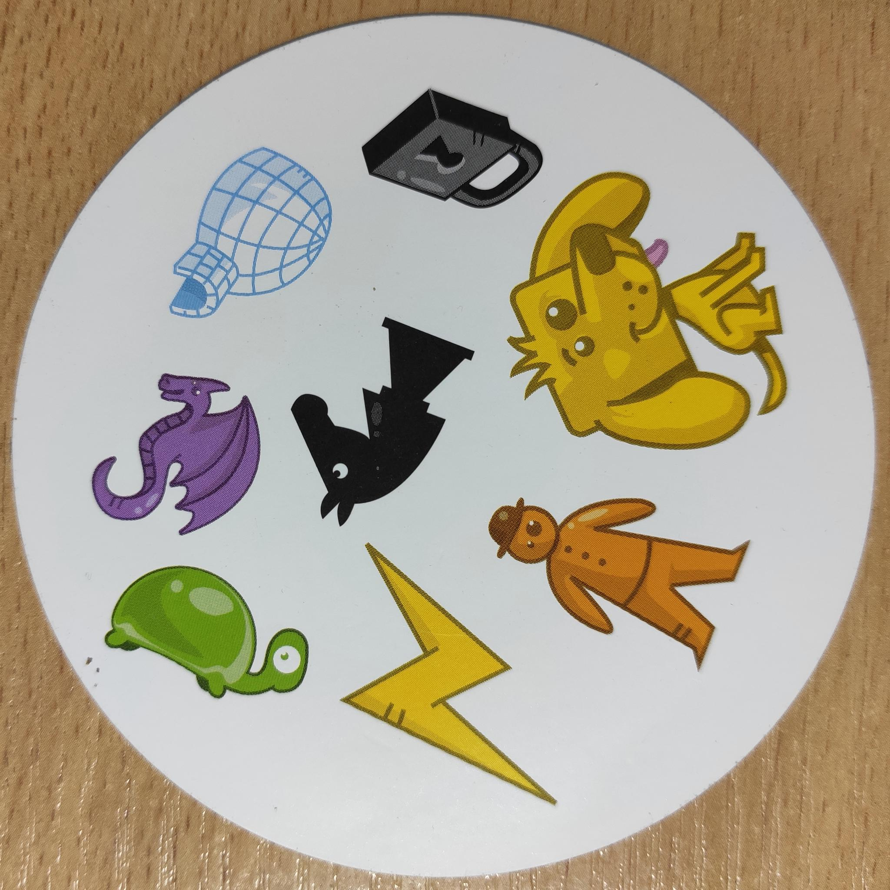
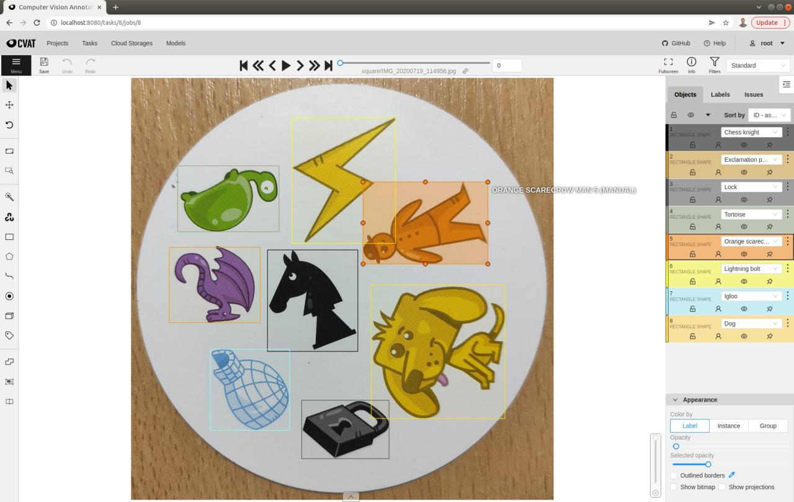
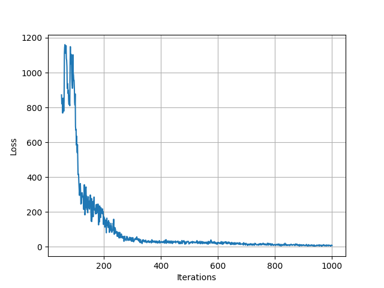
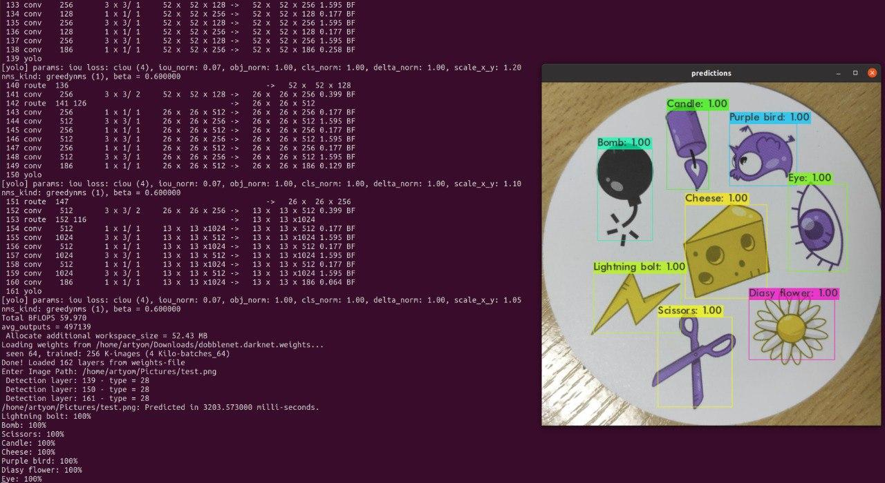

# How to train YoloV4 Dobblenet in the Darknet format

Once upon a time, when everyone worked from the office and did not think about remote work, my colleagues and I decided to take a break from our hardwork and play game that can distract us from routine and chose to play the Dobble (you may know the game as Spot it).  

## The Dobble
Dobble is a speed and observation card game for the everyone.
The dobble cards are circular and each card contains 8 images of specific cartoon icons, for example, `Taxi`, `Apple`, `Target` and etc. There are 57 classes of icons and 55 cards in the game.
Every two cards contain only one identical image and a player must find this identical image in the pair of cards, say about it and put their card on the common deck faster than other players.
Then all players begin to look for the matching image in their cards and the card that was put on the desk. The player who gets rid of all cards in hands off the fastest wins.
You can find more information about this game on the website: www.dobblegame.com. Below you can find some photos of the dobble cards:

  

After we played it several times, it occurred to us that it would be nice to create a program that could, for example, help you to play Dobble or play against you. This is a speed game, so a computer can be faster than the most speedy human player. In such a way, the idea of creating an application for playing Dobble was born at that moment.  

We are working in a big OpenVINO team on creating the framework for neural networks optimization and inference. Of course, we wanted to use our framework called DL Workbench to build the tools, and a neural network should be the cornerstone of the tool.

## Detect task to be solved  
There were a lot of ideas, but we decided to build the application that finds images in each card of the game and, moreover, says where the image is located. It was absolutely clear for us that the neural network should solve Object Detection task. At that moment the most popular model to solve OD task was YoloV4, so we decided to use this topology. More information about YoloV4: https://arxiv.org/abs/2004.10934  

  
## The Data  
We realized that we needed a lot of data to train our neural network, so we started collecting a dataset by photographing the dobble cards we had. The deck of cards of this game contains 55 items and we took around 4 photos of each card from different angles. As a result, we took around 390 photos.
However, taking the photos is not the biggest problem of dataset collection. The main challenge was to annotate each icon for each photo. There are 8 images in each photo, so there are 3120 in the 390 images. To annotate means to determine coordinates of each object in every photo.
To annotate the dataset we used [CVAT tool](https://github.com/openvinotoolkit/cvat) that provides useful interface for annotating: for every image you need to draw a rectangle around each object as it is shown in the picture:

   

This is a hard work that was completed in a week or two, and you can find its results in the kaggle: https://www.kaggle.com/atugaryov/dobble  

  
But 390 images is not enough to train a model (as we thought). To get more images we used the roboflow tool to augment images and obtain more data - around 900 images. The dataset was split into 3 subsets: train, validation and test. This is necessary for successful training. You can find the resulting dataset  in the releases of the repository.  

## GPU Environement  

The data was ready for model training, so we started to research info on transfer learning of YoloV4 network. 
One of the most important aspects of training is to obtain access to hardware with GPU. We were lucky - we had a laptop with Nvidia GPUб so we only had to setup environment for GPU, i.e. drivers and CUDA environment. You can find extensive instructions in the Nvidia materials.  

## Set up Darknet repository  

The next step is environment preparation for YoloV4 transfer learning. We used the fork of AlexeyAB of Darknet repository to process transfer learning. To start the process, clone the main repository of the Dobblenet:  

```sh  
git clone git@github.com:artyomtugaryov/dobblenet.git
cd dobblenet
```  

The repository contains all the required assets (scripts, data and documentations) to create Dobblenet. The next step we have to do is to prepare python environment:  

```sh  
python3 -m pip install virtualenv
python3 -m virtualenv venv
source venv/bin/activate

python3 -m pip install -r requirements.txt
```  

And then we can download the prepared dataset using scripts from the repository:  

```sh  
python3 scripts/download_dataset.py --dataset-link https://github.com/artyomtugaryov/dobblenet/releases/download/alpha0.2/dobblenet_dataset.zip
```  

The dataset will apear in the `dataset` subfolder of the repository root.   
As we already said, we use the Darknet repository from the [AlexeyAB fork](https://github.com/AlexeyAB/darknet). So, we need to clone it:  

```sh  
git clone git@github.com:AlexeyAB/darknet.git
```

And move dataset files to the folder with the darknet repository:  

```sh  
python3 scripts/spread_dataset.py
```

The Darknet is a toolset and a library that helps us to train, validate and test dobblenet. To start using the Darknet we need to build it from sources. In order to do this, we firstly need to configure the `Makefile` in the root of the Darknet folder. Open the `Makefile` inside the darknet repository and make the following changes:  

  
If you have set up GPU and CUDNN:  

 1. `GPU=0` -> `GPU=1`    
 2. `CUDNN=0` -> `CUDNN=1`  
 
 
In addition, it is to recommended to speed up training stage by changing the following:  

 1. `OPENCV=0` -> `OPENCV=1` 
 2. `AVX=0` -> `AVX=1`

The next step is initialize the CUDA environment:

```sh  
export LD_LIBRARY_PATH="/usr/local/cuda-11.0/lib64:$LD_LIBRARY_PATH"  
export PATH="/usr/local/cuda-11.0/bin/:$PATH"  
```  

Now we can compile the darknet:

```sh  
cd darknet
make -j 4
mkdir training
```

After successful building you can find `darknet` binary file in the root of the darknet repository   

We will process transfer learning, so we need to download pre-trained weights of the YoloV4   

```sh  
wget https://github.com/AlexeyAB/darknet/releases/download/darknet_yolo_v3_optimal/yolov4.conv.137
```

The Darknet provides the opportunity to train different neural networks. We need to create configuration for YoloV4 tolopogy. The configuration file is already in the Dobblenet folder and you can use it to start training:  

```sh  
./darknet detector train data/obj.data ../configs/dobblenet.darknet.cfg yolov4.conv.137 -dont_show -map | tee training.log
```

Training logs will be saved to `training.log` file.  
The first output looks like the following:

```
CUDA-version: 11000 (11060), cuDNN: 8.0.4, GPU count: 1  
OpenCV version: 4.2.0
Prepare additional network for mAP calculation...
0 : compute_capability = 750, cudnn_half = 0, GPU: NVIDIA GeForce GTX 1650 with Max-Q Design 
net.optimized_memory = 0 
mini_batch = 1, batch = 64, time_steps = 1, train = 0 
layer   filters  size/strd(dil)      input                output
0 Create CUDA-stream - 0 
Create cudnn-handle 0 
conv     32       3 x 3/ 1    416 x 416 x   3 ->  416 x 416 x  32 0.299 BF
...
608 x 608 
Create 6 permanent cpu-threads 
try to allocate additional workspace_size = 81.03 MB 
CUDA allocate done! 
Loaded: 5.643464 seconds
v3 (iou loss, Normalizer: (iou: 0.07, obj: 1.00, cls: 1.00) Region 139 Avg (IOU: 0.000000), count: 1, class_loss = 4643.162598, iou_loss = 0.000000, total_loss = 4643.162598 
v3 (iou loss, Normalizer: (iou: 0.07, obj: 1.00, cls: 1.00) Region 150 Avg (IOU: 0.342851), count: 6, class_loss = 976.097534, iou_loss = 1.449280, total_loss = 977.546814 
v3 (iou loss, Normalizer: (iou: 0.07, obj: 1.00, cls: 1.00) Region 161 Avg (IOU: 0.368945), count: 13, class_loss = 519.587219, iou_loss = 0.669678, total_loss = 520.256897    
....
(next mAP calculation at 1000 iterations) 
1: 2219.531006, 2219.531006 avg loss, 0.000000 rate, 22.141197 seconds, 64 images, -1.000000 hours left
```

In the output we specially need to notice the value of loss (or mean loss) - this value shows how well the netwok detects icons. The less loss value is, the better.   
After finishing training process, you will see the following message:

```
 calculation mAP (mean average precision)...
 Detection layer: 139 - type = 28 
 Detection layer: 150 - type = 28 
 Detection layer: 161 - type = 28 
 ...
class_id = 0, name = Anchor, ap = 61.72%   	 (TP = 11, FP = 8) 
class_id = 1, name = Apple, ap = 100.00%   	 (TP = 9, FP = 0) 
class_id = 2, name = Baby bottle, ap = 100.00%   	 (TP = 12, FP = 0) 
...
 for conf_thresh = 0.25, precision = 0.90, recall = 0.99, F1-score = 0.94 
 for conf_thresh = 0.25, TP = 652, FP = 74, FN = 5, average IoU = 67.72 % 
 
 IoU threshold = 50 %, used Area-Under-Curve for each unique Recall 
 mean average precision (mAP@0.50) = 0.951733, or 95.17 % 
...
New best mAP!   
If you want to train from the beginning, then use flag in the end of training command: -clear
```

In the text of the message you can find information about mean average precision. As we can see in the message, mAP of the model is 0.960822 or 96.0822%. This is after 1000 iterations.  
Using logs, we can plot changes of loss and mean loss throughout training:

  

In addition, you can find mAP for each class:  

```
class_id = 0, name = Anchor, ap = 61.72%   	 (TP = 11, FP = 8) 
class_id = 1, name = Apple, ap = 100.00%   	 (TP = 9, FP = 0) 
class_id = 2, name = Baby bottle, ap = 100.00%   	 (TP = 12, FP = 0) 
class_id = 3, name = Bomb, ap = 100.00%   	 (TP = 6, FP = 0) 
class_id = 4, name = Cactus, ap = 100.00%   	 (TP = 11, FP = 1) 
class_id = 5, name = Candle, ap = 100.00%   	 (TP = 13, FP = 0) 
class_id = 6, name = Carrot, ap = 98.21%   	 (TP = 7, FP = 2) 
class_id = 7, name = Cheese, ap = 100.00%   	 (TP = 14, FP = 0) 
class_id = 8, name = Chess knight, ap = 99.09%   	 (TP = 10, FP = 3) 
class_id = 9, name = Clock, ap = 100.00%   	 (TP = 12, FP = 0) 
class_id = 10, name = Clown, ap = 98.90%   	 (TP = 13, FP = 1) 
class_id = 11, name = Diasy flower, ap = 71.18%   	 (TP = 12, FP = 6) 
class_id = 12, name = Dinosaur, ap = 81.90%   	 (TP = 7, FP = 6) 
class_id = 13, name = Dog, ap = 68.19%   	 (TP = 10, FP = 7) 
class_id = 14, name = Dolphin, ap = 92.56%   	 (TP = 12, FP = 2) 
class_id = 15, name = Dragon, ap = 94.70%   	 (TP = 11, FP = 2) 
class_id = 16, name = Exclamation point, ap = 100.00%   	 (TP = 10, FP = 0) 
class_id = 17, name = Eye, ap = 100.00%   	 (TP = 9, FP = 0) 
class_id = 18, name = Fire, ap = 97.50%   	 (TP = 8, FP = 5) 
class_id = 19, name = Four leaf clover, ap = 100.00%   	 (TP = 13, FP = 0) 
class_id = 20, name = Ghost, ap = 100.00%   	 (TP = 13, FP = 0) 
class_id = 21, name = Green splats, ap = 100.00%   	 (TP = 12, FP = 0) 
class_id = 22, name = Hammer, ap = 100.00%   	 (TP = 11, FP = 0) 
class_id = 23, name = Heart, ap = 96.57%   	 (TP = 14, FP = 2) 
class_id = 24, name = Ice cube, ap = 100.00%   	 (TP = 13, FP = 0) 
class_id = 25, name = Igloo, ap = 93.01%   	 (TP = 12, FP = 2) 
class_id = 26, name = Key, ap = 95.56%   	 (TP = 9, FP = 2) 
class_id = 27, name = Ladybird -Ladybug-, ap = 100.00%   	 (TP = 12, FP = 1) 
class_id = 28, name = Light bulb, ap = 70.88%   	 (TP = 11, FP = 2) 
class_id = 29, name = Lightning bolt, ap = 98.75%   	 (TP = 15, FP = 1) 
class_id = 30, name = Lock, ap = 100.00%   	 (TP = 13, FP = 0) 
class_id = 31, name = Maple leaf, ap = 100.00%   	 (TP = 9, FP = 0) 
class_id = 32, name = Moon, ap = 100.00%   	 (TP = 11, FP = 0) 
class_id = 33, name = No Entry sign, ap = 100.00%   	 (TP = 12, FP = 0) 
class_id = 34, name = Orange scarecrow man, ap = 84.13%   	 (TP = 14, FP = 4) 
class_id = 35, name = Pencil, ap = 90.91%   	 (TP = 10, FP = 0) 
class_id = 36, name = Purple bird, ap = 100.00%   	 (TP = 13, FP = 0) 
class_id = 37, name = Purple cat, ap = 96.67%   	 (TP = 9, FP = 1) 
class_id = 38, name = Purple dobble hand man, ap = 100.00%   	 (TP = 12, FP = 0) 
class_id = 39, name = Question mark, ap = 86.25%   	 (TP = 10, FP = 3) 
class_id = 40, name = Red lips, ap = 100.00%   	 (TP = 14, FP = 0) 
class_id = 41, name = Scissors, ap = 100.00%   	 (TP = 14, FP = 0) 
class_id = 42, name = Skull and crossbones, ap = 100.00%   	 (TP = 10, FP = 0) 
class_id = 43, name = Snowflake, ap = 100.00%   	 (TP = 11, FP = 0) 
class_id = 44, name = Snowman, ap = 66.67%   	 (TP = 6, FP = 5) 
class_id = 45, name = Spider, ap = 92.86%   	 (TP = 13, FP = 0) 
class_id = 46, name = Spider-s web, ap = 96.43%   	 (TP = 7, FP = 1) 
class_id = 47, name = Sun, ap = 100.00%   	 (TP = 9, FP = 1) 
class_id = 48, name = Sunglasses, ap = 100.00%   	 (TP = 13, FP = 0) 
class_id = 49, name = Target-crosshairs, ap = 100.00%   	 (TP = 13, FP = 0) 
class_id = 50, name = Taxi car, ap = 100.00%   	 (TP = 13, FP = 0) 
class_id = 51, name = Tortoise, ap = 100.00%   	 (TP = 11, FP = 0) 
class_id = 52, name = Treble clef, ap = 98.60%   	 (TP = 14, FP = 3) 
class_id = 53, name = Tree, ap = 93.66%   	 (TP = 19, FP = 3) 
class_id = 54, name = Water drip, ap = 100.00%   	 (TP = 12, FP = 0) 
class_id = 55, name = Yin and Yang, ap = 100.00%   	 (TP = 16, FP = 0) 
class_id = 56, name = Zebra, ap = 100.00%   	 (TP = 12, FP = 0) 
```

After the training is completed, the results (weights) are in `darknet/trainig` folder - `_best.weights` and `_last.weights`.  

## Visualize inference results.  
After training, you can visualize the results of inference on an image using the darknet. To do that, run the darknet in the test format:  

    ```sh
    ./darknet detector test data/obj.data ../configs/dobblenet.darknet.cfg training/yolov4_last.weights
    ```
And then pass a path to the image that you would like to inference. You will see the result of the inference in the opened window like in the screenshot:

